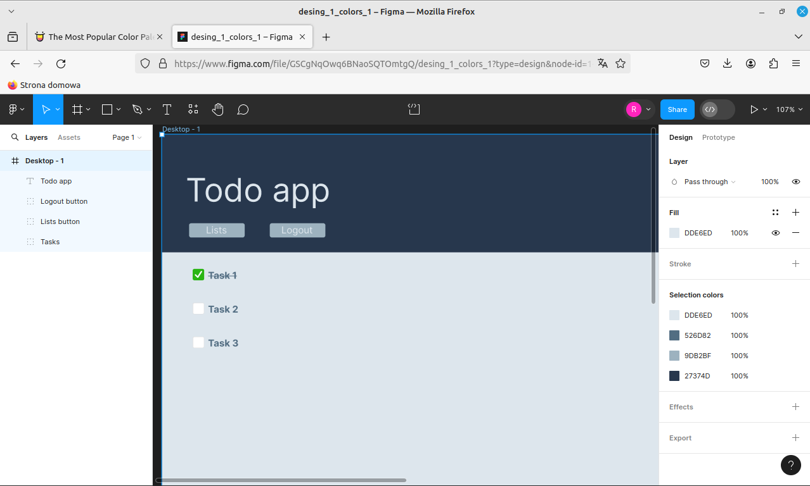

# Todo app:

## Tech stack:
* Django
* Nginx
* uWsgi

## Podstawowa funkcjonalność:
### Ogólne:
* Konta użytkowników (z osobnymi listami zadań)
* Przechowywanie informacji o wybranej liście zadań w sesji (cookies)

### Listy zadań:
* Model listy zadań:
  * Nazwa listy
  * Data utworzenia
  * Przynależność do użytkownika/ów 
* Przypisanie do aktualnie zalogowanego użytkownika

### Zadania:
* Model zadania:
  * Nazwa zadania
  * Czy wykonano?
  * Przynależność do listy
* Przypisanie do wybranej listy

### Interfejs:
* Strona główna z widokiem aktualnie wybranej listy zadań
  * Możliwość odznaczenia wykonanych zadań
  * Sortowanie zadań (nazwa/czy wykonano) (rosnąco/malejąco)
* Widok wszystkich list zadań
  * Wybór aktywnej listy z dostępnych
* Widok tworzenia nowej listy
  * Wpisywanie nazwy listy
	
## Planowana funkcjonalność (opcjonalna/rozwojowa):
### Ogólne:
* Potwierdzanie rejestracji użytkownika poprzez wiadomość e-mail
* Eksportowanie danych do kalendarza google calendar / samsung
* Przypomnienia e-mail o przekroczonych terminach wykonania zadań

### Listy zadań:
* Wczytywanie gotowych szablonów list
* Wybór dnia na który dodać listę (domyślnie dzień dzisiejszy)
* Możliwość udostępnienia i wspólnej pracy nad listą 
* Zapisywanie jako szablon 

### Zadania:
* Określanie terminu wykonania
* Kategoria zadania
* Priorytet

### Interfejs:
* Rozbudowa sortowania zadań uwzględniając nowe dane (termin wykonania, kategoria, priorytet)
* Wyszczególnienie zadań po terminie (np. czerwony kolor?)
* Podgląd udostępnionych list zadań
  * Pokazuje wszystkie udostepnione listy zadań
  * Wejście w daną listę ładuje jej podgląd

## UI design:
### Pierwsze szkice:

	
